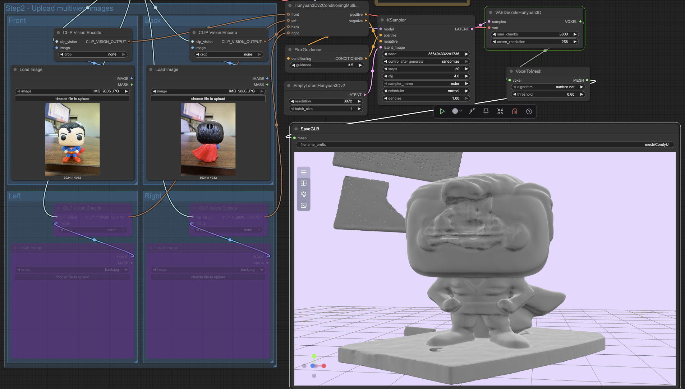
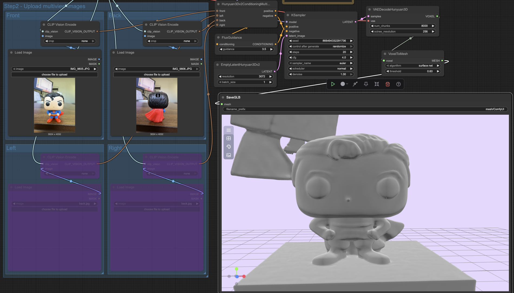
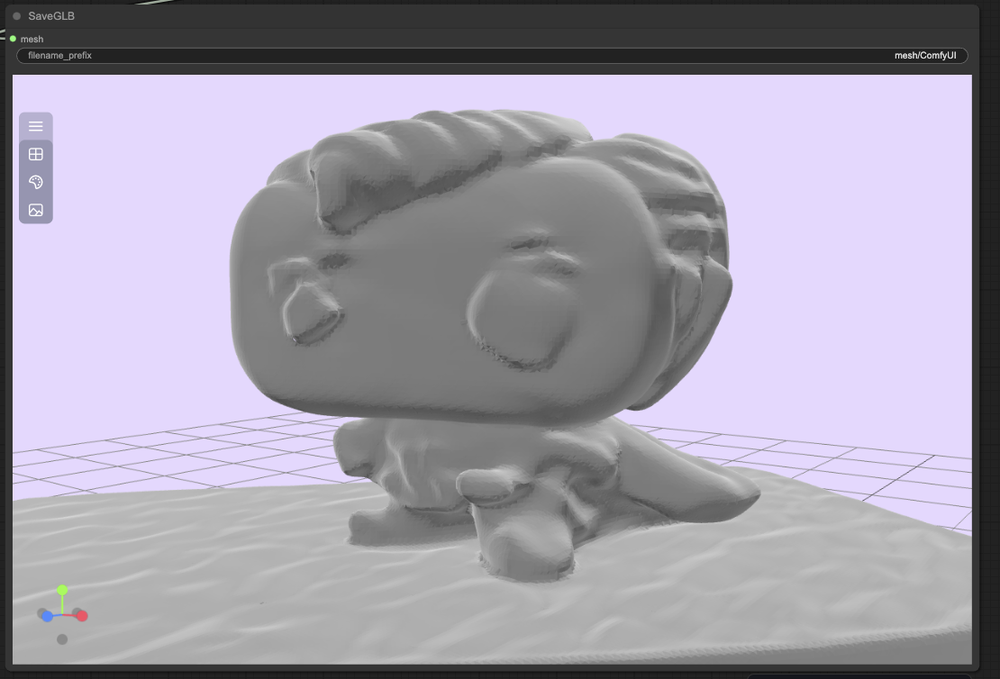
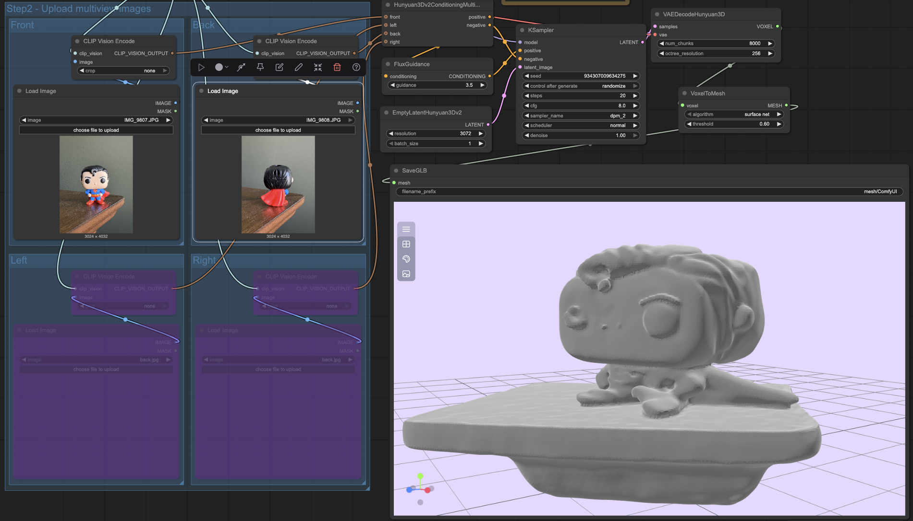
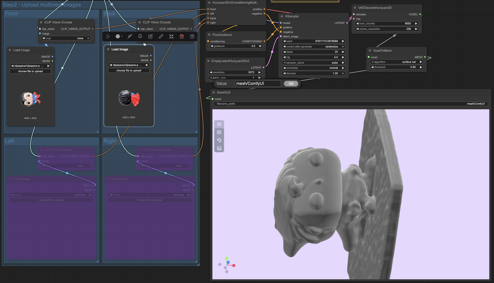

# comfyui-3d-tests
Exploring ComfyUI workflows.

# HunYuan3D Experiments (ComfyUI)
Exploring workflows to generate 3D assets from multi-view iPhone photos using the HunYuan3D Multiview to Model nodes in ComfyUI.  

**Why:** In production, fast turnaround for asset prototyping can save artists significant time.  
**What I tried:** Testing node graphs for multi-view reconstruction → mesh output.  

## Trials

### Attempt 1

### Attempt 2
 + Re-run with the same settings (better, learned result!)
 + The background monitors appear in the .GLB model

 

### Attempt 3
 + Attempted to adjust KSampler "cfg" parameter to 8.0

### Attempt 4
 + Re-took picture with a clearer background
 + Attempted to adjust Ksampler sampler_name model to "dpm_2" with "cfg" set to 8.0 (worse results)

### Attempt 5
 + Added a painted "Mask" to the supplied images
 + Set KSampler "sampler_name" model back to "euler"
 + Set KSampler "cfg" back to 4.0
 + Improved, but still overall malformed (Appears that screenspace size of object was too small for the model to distinguish features - possibly from iphone photo compression)

## Takeaway:
Promising results for small props taken up-close, with clean backgrounds and a user-defined mask; still limited fidelity for hero assets. Also, results appear to improve on subsequent re-runs.

### Notes:
 + Observed that defining a mask rotates source images 90 degrees CCW
 + Euler seemed like the best sampler model to use from limited trial set - further experimentation of the rest of the models is recommended
